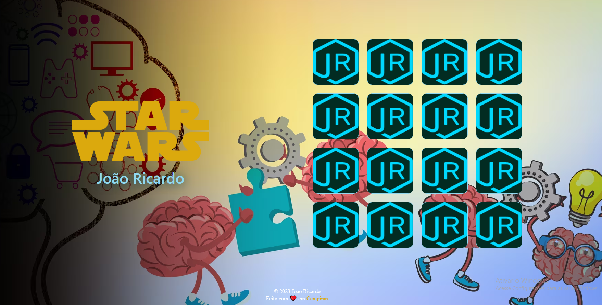
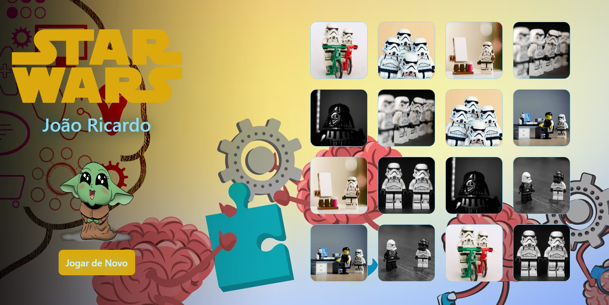

# Jogo da Memória
Este jogo da memória foi desenvolvido com React, Vite e TypeScript, utilizando styled-components para estilização. A temática principal deste jogo é o emocionante universo de Star Wars.

Neste jogo, o objetivo é encontrar pares de cartas viradas para baixo, revelando imagens icônicas relacionadas a Star Wars, personagens e naves da saga. Os jogadores precisam usar sua memória e habilidades de concentração para encontrar todas as correspondências corretas e desvendar os mistérios da galáxia distante.

Quando o jogador acerta os pares das cartas, um modal surge na tela, exibindo curiosidades fascinantes sobre os filmes, personagens e acontecimentos de Star Wars. Essas curiosidades são cuidadosamente selecionadas para transmitir de forma lúdica e informativa os segredos e detalhes fascinantes dessa saga épica, encorajando os jogadores a explorar ainda mais o universo de Star Wars.

Além de ser divertido e desafiador, o jogo da memória tem o objetivo de educar e entreter os fãs de Star Wars, oferecendo uma experiência interativa e envolvente. Ao descobrir fatos interessantes sobre a saga enquanto jogam, os fãs podem aprofundar seu conhecimento e apreciação por esse universo amado.

Com a combinação de tecnologias modernas e o fascinante mundo de Star Wars como pano de fundo, este jogo da memória é uma maneira divertida e educativa de mergulhar mais fundo na galáxia muito, muito distante. Os dados das cartas estão armazenados localmente e são embaralhados a cada nova partida, proporcionando uma experiência sempre empolgante. Que a Força esteja com você enquanto embarca nesta aventura memorável!

  

  

  

