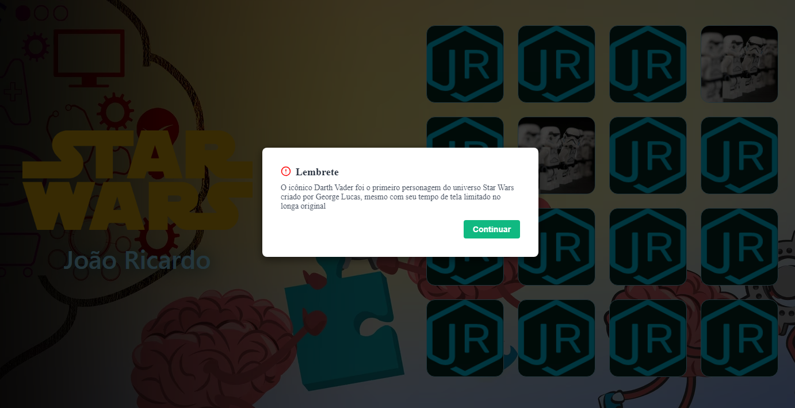

# Memory game focused on patient safety

O jogo da memória desenvolvido com React, Vite e TypeScript, utilizando o styled-components para estilização, tem como temática principal a segurança do paciente na UTI Pediátrica. 

Neste jogo, o objetivo é encontrar pares de cartas viradas para baixo, revelando imagens relacionadas à segurança do paciente e práticas adequadas na UTI Pediátrica. O jogador precisa usar sua memória e habilidades de concentração para encontrar todas as correspondências corretas.

Quando o jogador acerta os pares das cartas, um modal surge na tela, exibindo uma frase educativa ou um lembrete sobre a importância de medidas de prevenção na UTI Pediátrica. Essas frases são cuidadosamente selecionadas para transmitir de forma lúdica e informativa os princípios e boas práticas de segurança do paciente, incentivando uma maior conscientização e adesão a esses cuidados essenciais.

Além de ser divertido e desafiador, o jogo da memória tem o objetivo de educar e conscientizar os profissionais de saúde, familiares e até mesmo os próprios pacientes sobre a importância da segurança do paciente na UTI Pediátrica. Ao oferecer uma experiência interativa e envolvente, o jogo busca reforçar conceitos fundamentais e incentivar a adoção de comportamentos seguros, contribuindo para a promoção de um ambiente de cuidados mais seguro e eficaz.

Com a combinação de tecnologias modernas e uma temática relevante, esse jogo da memória se apresenta como uma ferramenta educativa interativa, que pode ser utilizada como um recurso complementar no treinamento, capacitação e sensibilização de profissionais da saúde e outros envolvidos no cuidado de pacientes na UTI Pediátrica. Os dados dos cards estão armazenados localmente, sendo submetidos a uma ordencão aleatória a cada nova partida. 

  

  

  

